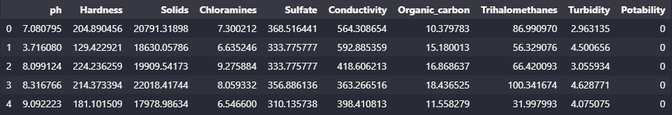

# Dataset: **"Drinking water potability"**

The dataset was extracted from the [**Kaggle**](https://www.kaggle.com/datasets/adityakadiwal/water-potability) platform.

- Dataset: [**Drinking water potability**](https://www.kaggle.com/datasets/adityakadiwal/water-potability)

The dataset provides water quality metrics for 3276 different water bodies, showing when water is potable or non-potable based on its characteristics (pH, hardness, dissolved solids, etc.). 

## **Features:**

**1. pH value:** This is an important parameter for assessing the acid-base balance of water, indicating its acidic or alkaline condition. The WHO recommends a maximum pH limit of 6.5 to 8.5. The values currently investigated (6.52-6.83) are within this range.

**2. Hardness:** Mainly caused by dissolved calcium and magnesium salts from geological deposits, hardness is defined as the ability of water to precipitate soap due to these minerals.

**3. Solids (Total Dissolved Solids - TDS):** Water has the ability to dissolve a wide range of inorganic and some organic minerals. High TDS values indicate high water mineralization.

**4. Chloramines:** Used as disinfectants in public water systems, most commonly formed when ammonia is added to chlorine to treat drinking water.

**5. Sulfate:** Naturally occurring substances found in minerals, soil, and rocks, with varying concentrations in different water sources.

**6. Conductivity:** The electrical conductivity of water increases with the concentration of dissolved ions, indicating the amount of dissolved solids present.

**7. Organic carbon:** From decomposing organic matter, it is a measure of the total amount of carbon in organic compounds in water.

**8. Trihalomethanes (THMs):** Compounds present in chlorinated water, the levels of which vary with the amount of organic matter in the water and temperature.

**9. Turbidity:** Depending on the amount of solid matter present in suspension, turbidity is a measure of the light emitting properties of water.

**10. Potability:** Indicates whether the water is safe for human consumption, where 1 means potable and 0 means non-potable.